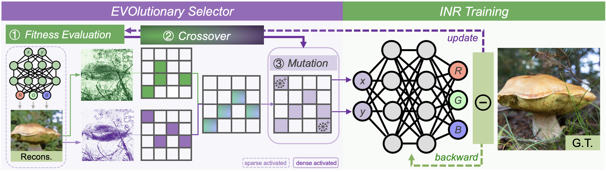
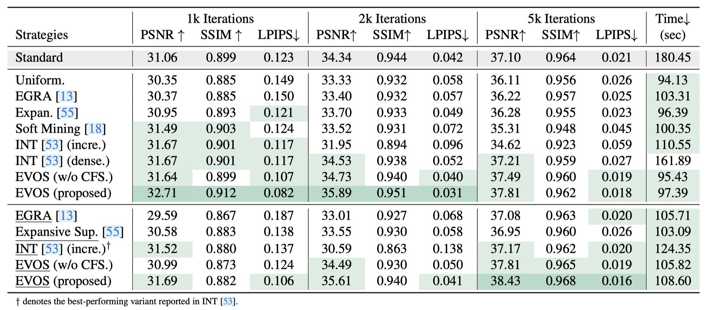

# EVOS: Efficient Implicit Neural Training via EVOlutionary Selector

### [Project Page](https://weixiang-zhang.github.io/proj-evos/) | [Paper](https://arxiv.org/pdf/2412.10153) | [Code](https://github.com/zwx-open/EVOS-INR) | [Supplementary](https://weixiang-zhang.github.io/proj-evos/static/pdfs/03247_supp.pdf) | [Checkpoints]()

[Weixiang Zhang](https://weixiang-zhang.github.io/),
[Shuzhao Xie](https://shuzhaoxie.github.io/),
Chengwei Ren,
Siyi Xie,
[Chen Tang](https://www.chentang.cc/),
Shijia Ge,
Mingzi Wang,
[Zhi Wang*](http://pages.mmlab.top/)<br>
Tsinghua University \
\*: Corresponding Author

This is the official PyTorch implementation of "EVOS: Efficient Implicit Neural Training via EVOlutionary Selector" (accepted by *CVPR 2025*).

# Overview
<p align="center">
  
</p>

**Abstract.** We propose **EVOlutionary Selector (EVOS)**, an efficient training paradigm for accelerating Implicit Neural Representation (INR). Unlike conventional INR training that feeds all samples through the neural network in each iteration, our approach restricts training to strategically selected points, reducing computational overhead by eliminating redundant forward passes. Specifically, we treat each sample as an individual in an evolutionary process, where only those fittest ones survive and merit inclusion in training, adaptively evolving with the neural network dynamics. While this is conceptually similar to Evolutionary Algorithms, their distinct objectives (selection for acceleration vs. iterative solution optimization) require a fundamental redefinition of evolutionary mechanisms for our context. In response, we design sparse fitness evaluation, frequency-guided crossover, and augmented unbiased mutation to comprise EVOS. These components respectively guide sample selection with reduced computational cost, enhance performance through frequency-domain balance, and mitigate selection bias from cached evaluation. Extensive experiments demonstrate that our method achieves approximately 48%-66% reduction in training time while ensuring superior convergence without additional cost, establishing state-of-the-art acceleration among recent sampling-based strategies.


# Quick Start
## Clone Repository
```shell
git clone https://github.com/zwx-open/EVOS-INR
cd EVOS-INR
```
## Enviroment Setup
> **Tested Enviroments**: 
</br> - Ubuntu 20.04 with PyTorch 1.12.1 & CUDA 11.3.1 on RTX 3090

## Run Demo
> Demo: Fit `DIV2K/test/00.png` with SIREN + EVOS(step-wise scheduler) (5k epochs; ~5minutes)
```shell
python demo.py 
```


# Reproducing Results from the Paper

## Table 1. Comparison of sampling strategies under fixed iterations.
<p align="center">
  
</p>

To reproduce the results presented in Table 1, uncomment the corresponding code section in `run.py` (approximately `line 41`). All baseline configurations have been pre-configured for replication purposes.
```python
if __name__ == "__main__":
   
    '''Reproduce Table_1 (Constant Scheduler)'''
    # param_idxs = [
    #     "full",
    #     "random",
    #     "egra",
    #     "expansive",
    #     "soft",
    #     "nmt_incre", 
    #     # "nmt_dense",
    #     "evos",
    #     "evos_wo_cfs"
    # ]
    # gpu_list = [0,1,2,3,4,5,6,7]
    # run_tasks("001", param_idxs, gpu_list)

    '''Reproduce Table_1 (Step-wise Scheduler)'''
    param_idxs = [
        "random",
        "egra",
        "expansive",
        "nmt_incre", 
        "evos",
        "evos_wo_cfs",
    ]
    gpu_list = [0,1,2,3,4,5,6,7]
    run_tasks("002", param_idxs, gpu_list)
```
```shell
python run.py
```
If only a single GPU is available, the experiments can be conducted sequentially by:
```python
    param_idxs = [
        "random",
        "egra",
        "expansive",
        "nmt_incre", 
        "evos",
        "evos_wo_cfs",
    ]
    gpu_list = [0]
    run_tasks("002", param_idxs, gpu_list)
```
The baseline configurations are implemented in `_by_sampler()` within `manager.py`, which can be customized to suit specific experimental needs.

## More Flexible Way
If you prefer a more flexible way to run this code, please refer to `demo.py`:
```python
def demo(use_cuda=0):
    args = [
        "--model_type",
        "siren",
        "--input_path",
        "./data/div2k/test_data/00.png",
        "--eval_lpips",
        "--log_epoch",
        "500",
        "--num_epochs",
        "5000",
        "--use_ratio",
        "0.2",
        "--strategy",
        "evos",
        "--sample_num_schedular",
        "step",
        "--tag",
        "evos",
        "--lr",
        "0.0001",
        "--up_folder_name",
        "000_demo_evos_stepwith",
    ]
    os.environ["CUDA_VISIBLE_DEVICES"] = str(use_cuda) 
    script = "python main.py " + " ".join(args)
    print(f"Running: {script}")
    os.system(script)


if __name__ == "__main__":
    demo(0)
```


# Checkpoints

Chekckpoints can be found in [here](https://drive.google.com/drive/folders/1VMtc84T4UsgoAluNKtOg-qoJXb1Z27q0?usp=drive_link). 
We thank @WillYao-THU for providing reproduced results and checkpoints in his environment.

# Acknowledgments
We thank the authors of the following works for releasing their codebases:
- [INT](https://github.com/chen2hang/INT_NonparametricTeaching)
- [Soft Mining](https://github.com/ubc-vision/nf-soft-mining)

# Additional Related Research
Welcome to explore our related research. The source code for all works has been available.
- (*AAAI'2025*) Enhancing Implicit Neural Representations via Symmetric Power Transformation | 
[[paper]](https://arxiv.org/abs/2412.09213)
[[project]](https://weixiang-zhang.github.io/proj-symtrans/)
[[code]](https://github.com/zwx-open/Symmetric-Power-Transformation-INR)
- (*ICME'2025*) Expansive Supervision for Neural Radiance Fields| 
[[paper]](https://arxiv.org/pdf/2412.10153)
[[code]](https://github.com/zwx-open/Expansive-Supervision)
- Recent Progress of Implicit Neural Representations | 
[[code]](https://github.com/zwx-open/Recent-Progress-of-INR)

# Citation
Please consider leaving a ⭐ and citing our paper if you find this project helpful:

```
@article{evos-inr,
  title={EVOS: Efficient Implicit Neural Training via EVOlutionary Selector},
  author={Zhang, Weixiang and Xie, Shuzhao and Ren, Chengwei and Xie, Siyi and Tang, Chen and Ge, Shijia and Wang, Mingzi and Wang, Zhi},
  journal={arXiv preprint arXiv:2412.10153},
  year={2024}
}
```

